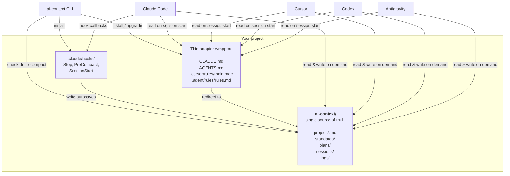
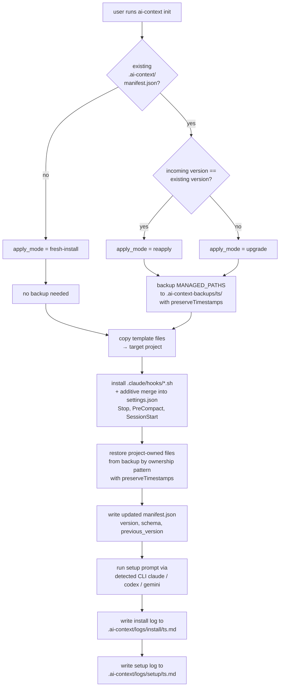
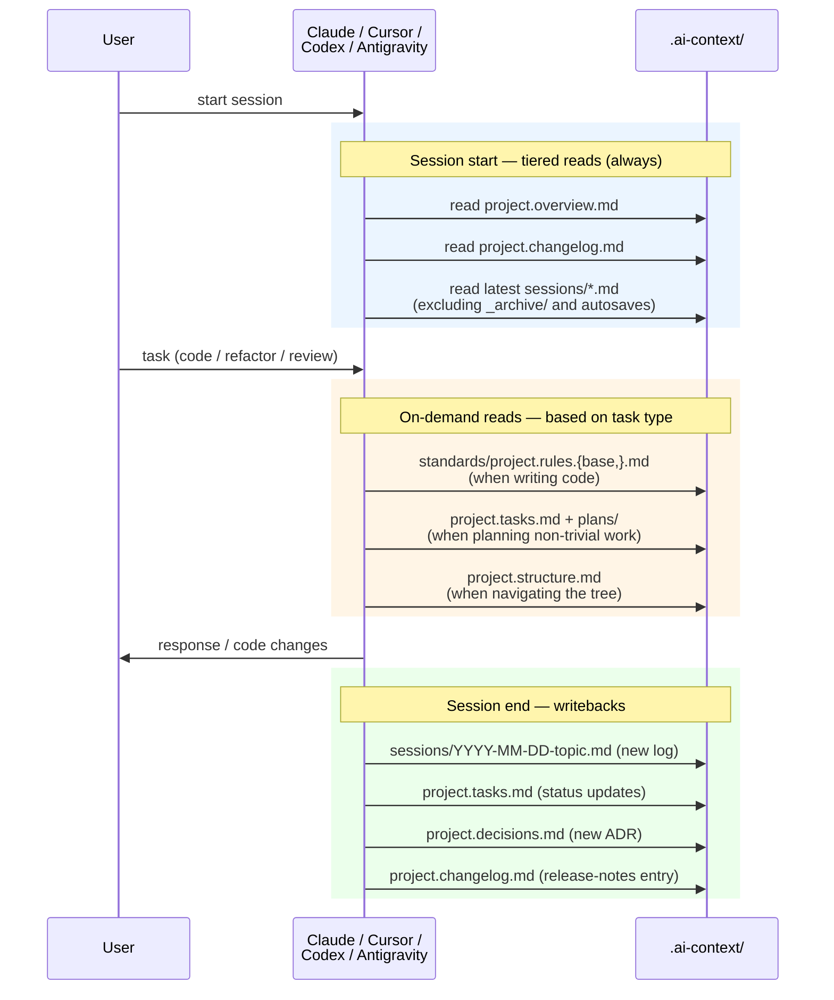
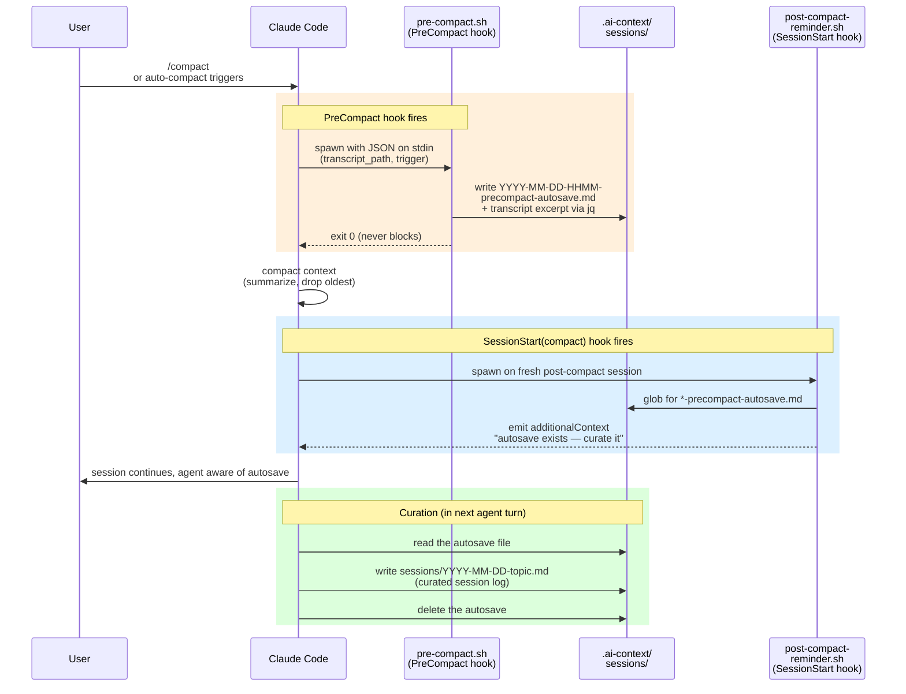
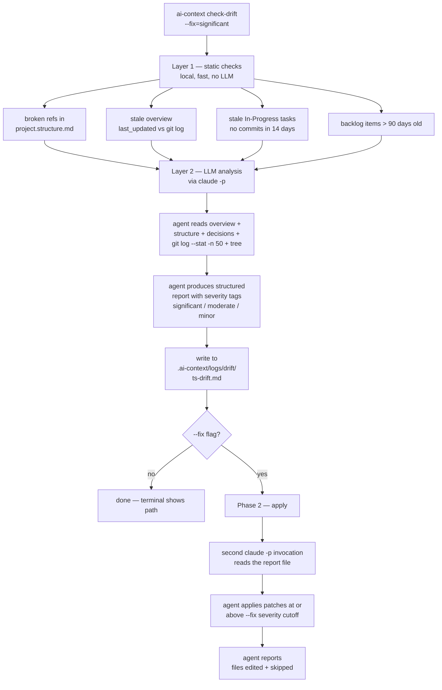
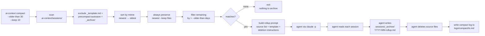

# ai-context Architecture

`ai-context` solves a single problem: **coding agents lose context when you switch between them or start a new session.** This document explains how the tool works end-to-end — the file layout it imposes, how agents consume it, and how the CLI operates on it.

For usage, see the [README](../README.md). This doc is for contributors and for readers who want to understand the design before adopting the tool.

---

## System overview

**Principles encoded in this diagram:**

- **One shared directory**, not per-agent configs. `.ai-context/` is the authoritative state.
- **Thin adapters**. Agent-specific files contain pointers, not content. Keeps context windows clean.
- **Hooks are invisible glue**. Claude Code hooks fire automatically to preserve context on compaction; users don't invoke them.
- **The CLI is orthogonal**. Agents work without the CLI once installed. The CLI is only for install, maintenance (drift, compact), and removal.

---

## Install / upgrade flow

Running `ai-context init` (or the non-interactive `ai-context apply`) walks through a backup-then-copy-then-restore pipeline designed to never destroy user content.

**Key properties:**

- **Every run is recoverable.** Backups land in `.ai-context-backups/<timestamp>/` before any overwrite.
- **Additive hook merge.** The installer adds missing hook events without touching hooks the user owns. A v1.0 install with only `Stop` is cleanly upgraded to v1.1's `Stop + PreCompact + SessionStart`.
- **Ownership-based restore.** `project.overview.md` (project-owned) is restored from backup; `project.rules.base.md` (tool-owned) is not. See [File ownership model](#file-ownership-model) below.
- **Timestamps preserved.** `fs.cp` runs with `preserveTimestamps: true` in both backup and restore so session-log age tracking survives upgrades. Without this, `ai-context compact` would see every file as brand new after each upgrade.

---

## Agent session lifecycle

Every agent that reads `.ai-context/` follows the same tiered protocol on session start, and the same end-of-session writeback discipline.

**Why tiered, not all-at-once:** agents have finite context windows. Loading every standards file up front would consume the budget that should go toward the actual code and conversation. The tiered protocol front-loads orientation (always-read) and defers everything else to on-demand reads based on the current task.

### Three project files, three time horizons

The "Always-read" list includes `project.overview.md` and `project.changelog.md` but **not** `project.tasks.md` or `project.backlog.md`. That's deliberate — each file serves a different time horizon:

| File | Horizon | What it holds | Update cadence |
|---|---|---|---|
| `project.tasks.md` | **Now** — active work | In-progress, blocked, next-up. Concrete and actionable. | Often (per-session) |
| `project.backlog.md` | **Later** — ideas pipeline | Deferred work, feature ideas, tech debt. Not yet ready to start. | Occasionally (when grooming) |
| `project.changelog.md` | **Past** — shipped history | Immutable record of releases, organized by version. User-visible changes only. | On release boundaries |

The lifecycle of an idea flows in one direction: `backlog.md` → (when work begins) `tasks.md` → (when done) possibly `changelog.md` under a version heading.

For session-start orientation the tool picks `changelog.md` + `latest sessions/*.md` rather than `tasks.md` because:

- **`changelog.md` is a stable anchor.** It describes what the project *is* at this moment — which features shipped, which fixes landed. Entries don't change after they're written, so it never misleads.
- **`tasks.md` is volatile.** A stale "In Progress" marker can give the agent a wrong picture of what's actually happening. It's authoritative when you're planning, not when you're orienting.
- **The latest session log is where the "right now" view lives.** Its `Next Steps` section is typically the freshest snapshot of active work — written minutes before the previous session ended, by the agent that was doing the work.

So the session-start triad covers three horizons without needing to read every file: overview (what this project is) + changelog (what has shipped) + latest session (what was just happening). `tasks.md` and `backlog.md` move to the on-demand tier and are read when the user's request is explicitly about planning or queueing work.

### "Latest file in sessions/" — it's literally one file

The adapter rule says "latest file in `sessions/` (excluding `_archive/`)" — emphasis on **file**, singular. Agents never scan the whole sessions folder at session start; they pick the single most-recently-modified non-archive, non-autosave log. For a mature project with 100+ session files, scanning all of them would blow out the context window.

This is why `ai-context compact` exists: it archives old sessions into `sessions/_archive/YYYY-MM-rollup.md` so the set of candidates for "latest" stays small and fresh. The `_archive/` folder's README tells agents not to read it at session start (and the `sessions/` glob excludes it explicitly). So the always-read load stays bounded: one overview + one changelog + one session log, no matter how big the project grows.

### Which writebacks are mandatory

A new session log and updated task status happen every session. `project.decisions.md` gets a new ADR only when the session made a non-trivial architectural choice worth explaining later. `project.changelog.md` gets an entry only for changes a downstream consumer of the project would care about (new features, user-visible fixes, breaking changes) — internal refactors don't belong there. Agents are expected to judge each case; when in doubt, err toward logging.

---

## Context-preservation flow (Claude Code hooks)

Claude Code's context window compacts when it fills up — either automatically near the token limit, or manually via `/compact`. Compaction is lossy by nature: the agent receives a summary, not the full transcript. `ai-context` installs two hooks that turn compaction into a safe, automatic checkpoint.

**Design decisions:**

- **Both manual and auto triggers run the same path.** An earlier design blocked manual `/compact` to force a session log first; that friction wasn't worth it. The autosave captures context regardless of trigger.
- **SessionStart(compact) is the only event that can inject context post-compaction.** `PostCompact` exists but can't reach the agent. `SessionStart(compact)` uses `additionalContext` — the hook system's only channel back into the running session.
- **Graceful `jq` degradation.** If `jq` isn't installed, the autosave still writes a stub with a pointer to the transcript JSONL path. Context isn't lost even in minimal environments.

---

## Drift detection (`check-drift`) and auto-apply (`--fix`)

`.ai-context/` can drift from the actual codebase as the project evolves. `check-drift` detects drift in two layers and optionally applies patches.

**Severity cutoff semantics:**

| Flag | Applies |
|---|---|
| `--fix` (default) | `[significant]` only |
| `--fix=significant` | `[significant]` only |
| `--fix=moderate` | `[significant]` + `[moderate]` |
| `--fix=minor` | everything |
| `--fix=all` | everything (alias for `minor`) |

**Why file-first:** storing the report to disk lets `--fix` (Phase 2) read it deterministically, lets users re-run just the apply step later, and provides an audit trail. Without a file, users had to copy-paste ~200-line reports from terminal scrollback into a fresh session to apply anything.

---

## Session compaction flow

Session logs accumulate. After months of use, there can be hundreds — too many for "read the latest session" to remain useful. `compact` archives old sessions into a single rollup and deletes the originals.

**The rollup is structured, not a dump.** The prompt instructs the agent to extract (not copy) three classes of preserved content:

- Decisions carried forward (still in effect)
- Open threads at end of range (unresolved work)
- File/area knowledge (non-obvious context about specific files)

Source sessions are then deleted. Rollup file has `archived: true` frontmatter and the `_archive/` folder's README tells agents not to read it at session start — so rollups are reference material, not current state.

---

## File ownership model

Every file under `.ai-context/` is either **tool-owned** (shipped by `ai-context`, replaced on upgrade) or **project-owned** (your content, preserved across upgrades).

| Path | Ownership | On upgrade |
|---|---|---|
| `.ai-context/manifest.json` | Tool | Rewritten with new version/schema metadata |
| `.ai-context/README.md` | Tool | Replaced with new version |
| `.ai-context/project.overview.md.template` | Tool | Replaced (fallback for `project.overview.md`) |
| `.ai-context/standards/project.rules.base.md` | Tool | Replaced |
| `.ai-context/standards/project.workflow.base.md` | Tool | Replaced |
| `.ai-context/standards/README.md` | Tool | Replaced |
| `.ai-context/sessions/_template.md` | Tool | Replaced |
| `.ai-context/sessions/_archive/README.md` | Tool | Replaced |
| `.ai-context/plans/_template.md` | Tool | Replaced |
| `.ai-context/logs/README.md` | Tool | Replaced |
| `.ai-context/project.overview.md` | Project | Restored from backup |
| `.ai-context/project.tasks.md` | Project | Restored from backup |
| `.ai-context/project.decisions.md` | Project | Restored from backup |
| `.ai-context/project.changelog.md` | Project | Restored from backup |
| `.ai-context/project.backlog.md` | Project | Restored from backup |
| `.ai-context/project.structure.md` | Project | Restored from backup |
| `.ai-context/standards/project.rules.md` | Project | Restored from backup |
| `.ai-context/standards/project.workflow.md` | Project | Restored from backup |
| `.ai-context/standards/project.<lang>.md` | Project | Restored from backup (created by `init` setup prompt on first install) |
| `.ai-context/sessions/*.md` | Project | Restored from backup |
| `.ai-context/plans/*.md` | Project | Restored from backup |
| `.ai-context/sessions/_archive/*.md` | Project | Restored from backup |
| Any other custom file under `.ai-context/**` | Project | Restored from backup |

The **restore logic** (`restoreProjectOwnedFiles` in `packages/cli/src/core/restore.ts`) walks the backup tree, checks each file against `isAiContextOwned()`, and restores any that aren't tool-owned. Custom files users add (e.g., their own `project.typescript.md` or domain-specific context files) are preserved by default — no explicit allowlist needed.

---

## Command-level reference

All commands live in `packages/cli/src/commands/` and share a small set of core modules:

| Command | Primary logic | Log output |
|---|---|---|
| `init` / `apply` | `core/install.ts`, `core/copyTemplates.ts`, `core/claudeHooks.ts`, `core/restore.ts` | `.ai-context/logs/install/` |
| `setup` | `core/setupFlow.ts`, `core/agentCLI.ts` | `.ai-context/logs/setup/` |
| `check-drift` | `commands/checkDrift.ts` + static checks inline | `.ai-context/logs/drift/` |
| `compact` | `commands/compact.ts` | `.ai-context/logs/compact/` |
| `uninstall` | `commands/uninstall.ts` | (none — terminal only) |
| `status` | `commands/status.ts` | (none — terminal only) |
| `version` | `commands/version.ts` | (none — terminal only) |

Shared primitives used by the LLM-driven commands (`setup`, `check-drift`, `compact`):

- **`core/agentCLI.ts`** — registry of known CLIs (claude, codex, gemini), health checks, prompt execution with `--permission-mode acceptEdits` + pre-approved read-only Bash patterns (`diff`, `find`, `cat`, `ls`, `git diff|log|status`, `rg`, `tree`).
- **`core/clipboardFallback.ts`** — `executeOrCopy()` is the unified entry point. Tries the CLI first; on failure OR empty stdout, copies the prompt to clipboard with a clear paste hint. Does NOT fall back on permission denials alone — if stdout came through, the run counts as executed.
- **`core/logWriter.ts`** — `writeCommandLog({ category, content })` writes `.ai-context/logs/<category>/<iso-ts>.md`. Append-only across upgrades.

---

## Design principles

- **File system is the interop layer.** No daemon, no database, no cloud. Markdown files every agent and human can read, edit, grep, commit. The only stateful thing is the Claude Code transcript JSONL, and even that is a pointer (held in autosave files), not a copy.
- **Adapters are thin.** `CLAUDE.md` is one line (`@AGENTS.md`) plus a few Claude-specific notes. `AGENTS.md` is ~40 lines. Neither duplicates `.ai-context/` content. This keeps agents' context windows clean and makes the single-source-of-truth rule actually enforceable.
- **Tiered reading.** Always-read for orientation; on-demand reads for task-specific detail. Agents have finite context; this convention uses it efficiently.
- **Hooks, not humans, preserve context.** Session logging is mandatory by convention, but also backstopped by Claude's Stop hook (reminder) and PreCompact hook (autosave). Users get a working system even when their discipline slips.
- **Every action is reversible.** Backups before every install. Nested `.ai-context/.git/` supported (filter excludes it from backup/restore). All LLM-driven commands have clipboard fallback. See the [README's Safety & rollback section](../README.md#safety--rollback).
- **Ownership-based, not allowlist-based.** Project-owned files are identified by pattern, not enumerated. Custom files users add under `.ai-context/**` are preserved automatically.
- **Logs always persist.** Install, setup, drift, compact — every run writes a markdown log to `.ai-context/logs/<category>/`, regardless of outcome (executed, clipboard, printed, failed). Users can audit what the tool + their agents actually did.

---

## Extension: adding a new agent

To support a new coding agent:

1. **Add the adapter file.** A thin file pointing at `.ai-context/` in whatever format the agent expects (e.g. `.newagent/rules.md`). Mirror the tiered reading + end-of-session discipline from existing adapters.
2. **Register in `copyTemplates.ts`.** Add an entry to `AGENT_FILES` mapping the agent ID to its file(s), and to `TEMPLATE_TO_TARGET` for the path mapping.
3. **Add to `selectAgents()` in `prompts/agentSelector.ts`** so users can pick it during `init`.
4. **(Optional) Add CLI support.** If the agent has a headless CLI like `claude -p`, register it in `agentCLI.ts`'s `CLI_REGISTRY` with appropriate flags. This enables `setup`, `check-drift`, `compact` to execute via that CLI instead of falling back to clipboard.

No changes to `.ai-context/` layout are needed — the whole directory is agent-agnostic by design.

---

## Further reading

- [README](../README.md) — user-facing docs and usage
- [Release history](../.ai-context/project.changelog.md) — when the tool is installed, this file lists user-visible changes version by version
- [LICENSE](../LICENSE) — MIT
